# Tugas 1 IF3110 Pengembangan Aplikasi Berbasis Web

> Diselesaikan oleh Kelompok: **sekelompok_sampe_lulus**
> 1. 13516008 - M. Aufa Helfiandri
> 2. 13516056 - M. Rafli Al Khadafi
> 3. 13516056 - Rifqi Rifaldi Utomo

## Dokumentasi Fitur

### Login
Berikut merupakan tampilan laman login yang telah kami dibuat

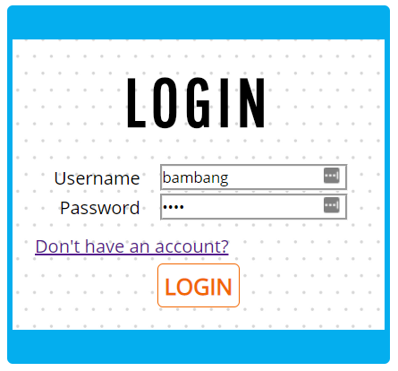

Pada laman login berikut ini, kami berhasil mengimplementasikan tampilan yang mirip dengan mockup yang telah diberikan.

Validasi diberikan kepada tiap field. Jika field kosong maka tidak akan bisa login dan tombol menjadi abu-abu.
Setelah log in, maka browser akan menyimpan cookie yang berisi data-data pengguna. Hal ini berfungsi sebagai penanda bahwa pengguna tersebut telah melakukan log in dan bisa mengakses fitur-fitur lain pada web ini.

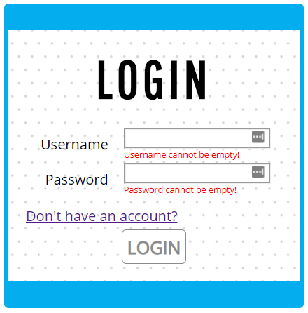

### Register
Berikut merupakan tampilan laman register yang telah kami dibuat

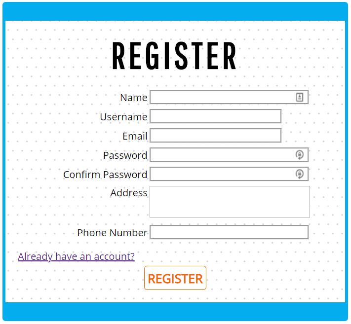

Tampilan register yang kami buat mirip dengan mockup yang telah diberikan. 
Terdapat fitur validasi untuk tiap field pada laman ini. Untuk tiap field tidak diperbolehkan untuk kosong. Jika kosong maka akan ditampilkan pesan validasi 'This field is required' untuk setiap field yang kosong. Adapun kolom username dan email juga dilakukan validasi menggunakan AJAX, sehingga apabila username atau email sudah terdaftar akan ditampilkan pesan error serta tanda silang pada sebelah kanan kolom isian. Adapun jika username dan email memenuhi kriteria dan masih tersedia, maka pesan akan hilang dan tanda pada bagian kanan kolom isian akan berubah menjadi centang sesuai spesifikasi. Kami juga memvalidasi agar confirm password memiliki nilai yang sama dengan password, serta phone number harus berupa angka dengan jumlah digit 9-12. Kami pun membuat asumsi dengan menambahkan validasi pada username, yakni username tidak boleh mengandung whitespace.

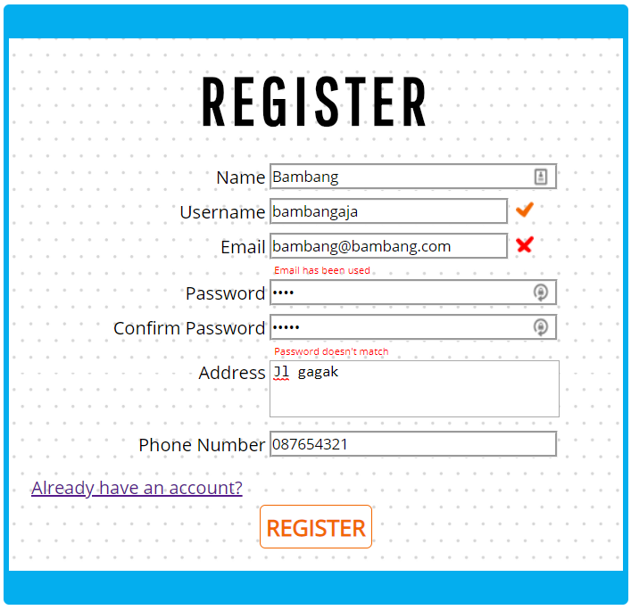

### Search
Berikut merupakan tampilan laman search yang telah kami dibuat

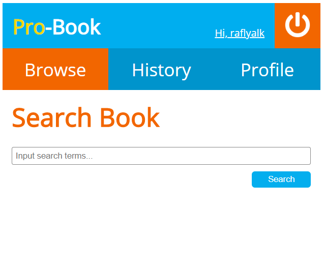

User dapat menuliskan nilai yang ingin dicari ke form search dan kemudian menekan tombol submit. Nilai yang dituliskan pada form search akan dipass menggunakan URL ke laman search Result

### Search Result
Berikut merupakan tampilan laman search result yang telah kami dibuat

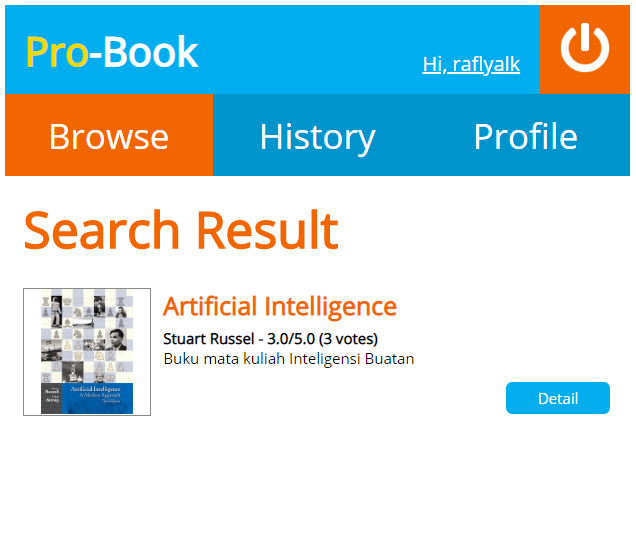

Nilai yang telah dipass ke Search Result akan ditampilkan dalam bentuk list dan untuk melihat dari buku hasil search yang dituliskan dapat dilakukan dengan menekan tombol detail yang berada di tiap buku.

### Book Detail
Berikut merupakan tampilan laman book detail yang telah kami dibuat

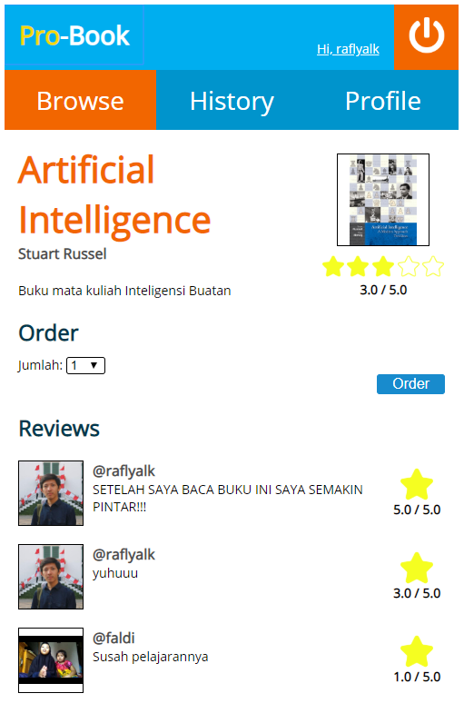

Pada book detail terdapat penjelasan dari buku serta review dari buku tersebut dan tombol untuk memesan buku. Apabila buku belum memiliki review, maka akan ditampilkan pesan yang menandakan bahwa buku belum ada yang mereview.
Berikut notifikasi yang diterima ketika berhasil menekan tombol order

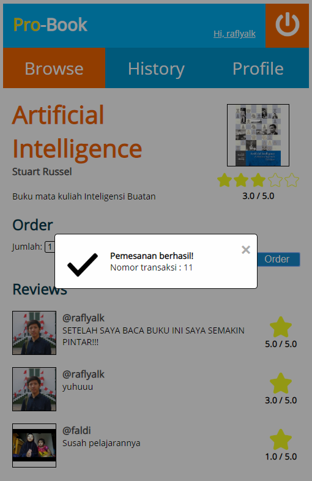

Notifikasi dibuat menggunakan AJAX. Notifikasi ditampilkan setelah program selesai memasukkan pesanan ke basis data server. Server akan mengirimkan order_id pada pengguna untuk selanjutnya ditampilkan. Notifikasi dibuat menggunakan modal agar tampilan menyerupai contoh.

### Profile
Berikut merupakan tampilan laman profile yang telah kami dibuat

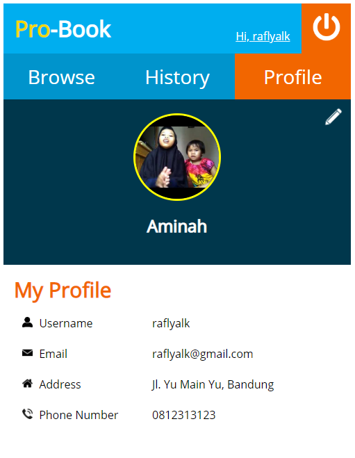

Pada Laman Profile terdapat data data yang telah dimasukkan oleh user pada saat register dan edit profile. Pada bagian atas terdapat foto pengguna dan nama lengkap pengguna. Pada bagian bawah halaman ini terdapat detail pengguna seperti username, email, alamat rumah dan nomor telepon. Pada sudut kanan atas terdapat ikon edit untuk mengubah data pada profil. Apabila diklik, makan pengguna akan diarahkan ke laman edit profile.

### Edit Profile
Berikut merupakan tampilan laman edit profile yang telah kami dibuat

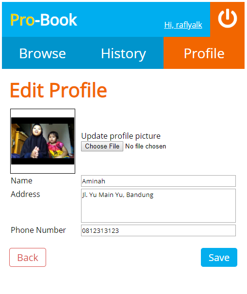

Pada laman ini terdapat berbagai macam input fields. Ada yang bertipe file (untuk upload profile picture), ada yang bertipe text biasa (untuk nama), textarea (untuk alamat), dan tel (untuk telepon).

Setiap input terdapat batasan sebagai berikut:
1. Foto harus bertipe jpg, png, gif, jpeg
2. Ukuran foto harus < 1MB
3. Field nama, alamat, nomor telepon tidak boleh kosong
4. Field nomor telepon panjangnya minimal 9 dan maksimal 12

Pesan validasi akan dimunculkan ketika tiap field tidak memenuhi batasan tersebut

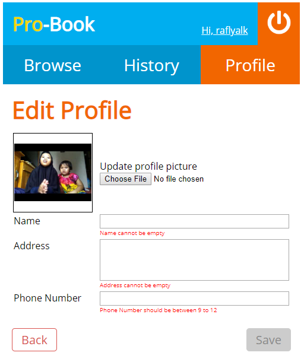

Untuk validasi foto digunakan passing by URL. Dideteksi oleh php apakah ukuran file > 1MB atau file yang diinput bukan tipe image.

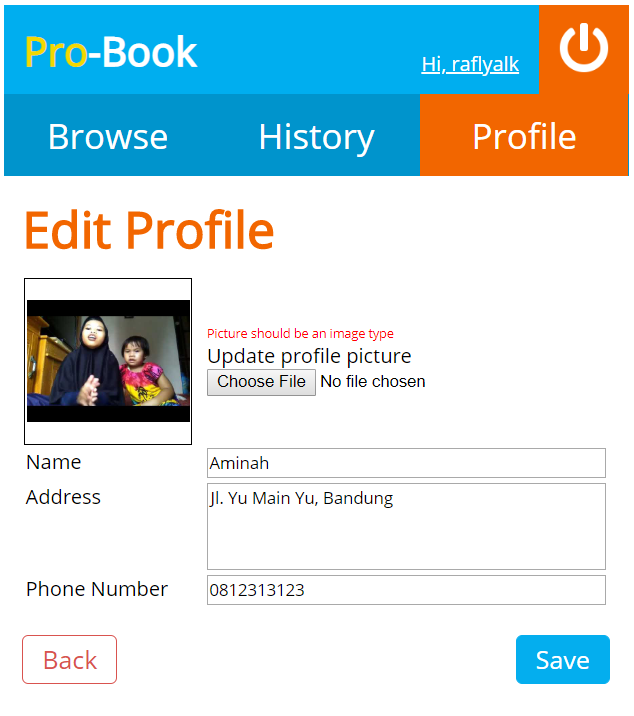

### History
Berikut merupakan tampilan laman history yang telah kami dibuat

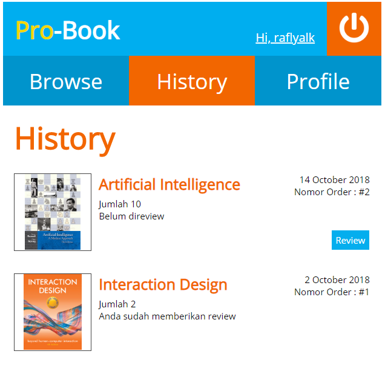

Laman history ini memuat list order-order yang telah dilakukan dan menampilkan buku serta info-info lainnya. Untuk order yang belum pernah direview akan muncul tombol **Review**

Jika kita klik tombol review, maka akan redirect ke laman
**view/review?order-id={o-id}**, dengan **{o_id}** diisi dengan order-id buku yang bersangkutan. Ini merupakan salah satu metode penanganan state menggunakan passing by URL. 

### Review
Berikut merupakan tampilan laman review yang telah kami dibuat

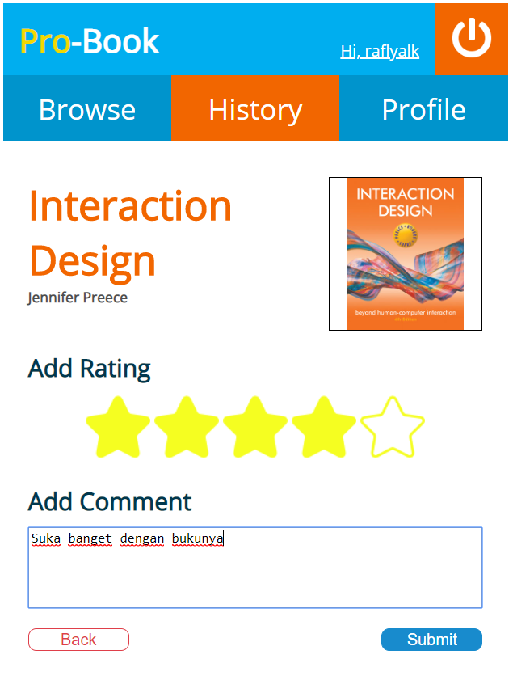

Laman review dapat diakses dari laman history untuk buku yang belum di review. Pada review, terdapat dua kolom yakni rating dan comment dengan kedua field harus diisi, apabila tidak diisi maka tidak akan bisa mengirimkan review. Halaman ini menggunakan tampilan bintang untuk memasukkan rating sesuai dengan yang tertera pada spek, serta tombol back yang membawa pengguna kembali ke history.

## Pembagian Tugas
**Tampilan**
1. Login : 13516056
2. Register : 13516098
3. Search Books : 13516008, 13516056
4. Search Result : 13516008, 13516056
5. Book Detail : 13516098
6. Profile : 13516008, 13516056
7. Edit Profile : 13516056
8. History : 13516056
9. Review : 13516098

**Fungsionalitas**
1. Login : 13516056
2. Register : 13516098
3. Search Books : 13516008
4. Search Result : 13516008
5. Book Detail : 13516098
6. Profile : 13516008
7. Edit Profile : 13516056
8. History : 13516056
9. Review : 13516098
10. Database : 13516008, 13516056